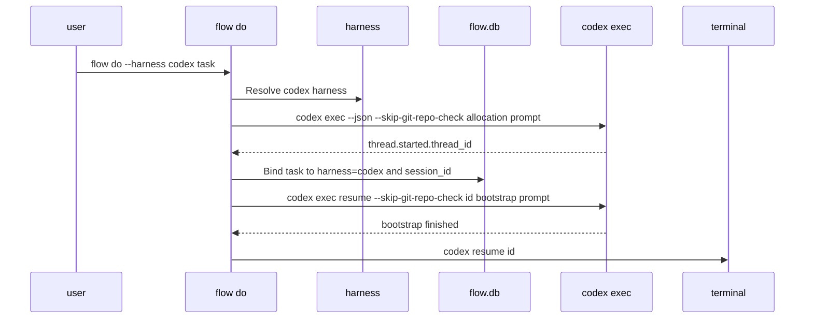

# Codex Harness Support Implementation Plan

> **For agentic workers:** REQUIRED SUB-SKILL: Use superpowers:subagent-driven-development (recommended) or superpowers:executing-plans to implement this plan task-by-task. Steps use checkbox (`- [ ]`) syntax for tracking.

**Goal:** Add first-class Codex harness support to Flow while preserving Claude behavior, existing task data, and the user's real Flow database.

**Architecture:** Extend the existing harness registry so app commands choose a harness by task pin, explicit flag, ambient session env, or Claude default. Codex-specific CLI commands, hooks, skills, transcript lookup, and process scanning live behind `internal/harness/codex`, while `internal/app` stays provider-neutral.

**Tech Stack:** Go, `database/sql`, `modernc.org/sqlite`, package-level fake runners for subprocess tests, Codex CLI JSON events, Claude Code hook JSON, Codex hook JSON.

---

## Source Documents

- Design spec: `docs/superpowers/specs/2026-05-28-codex-harness-support-design.md`
- OpenAI Codex CLI reference: <https://developers.openai.com/codex/cli/reference>
- OpenAI Codex hooks reference: <https://developers.openai.com/codex/hooks>

## Safety Envelope

All implementation work happens in the isolated worktree:

```bash
cd /private/tmp/flow-codex-support
git status --short --branch
```

Expected branch:

```text
## codex/codex-harness-support...origin/main [ahead 1]
```

Use these environment values for every test command that can compile or run Flow:

```bash
export FLOW_ROOT=/private/tmp/flow-codex-dev/flow-root
export GOCACHE=/private/tmp/flow-codex-dev/go-cache
```

Rules:

- Do not edit `/Users/Swapnil/workspace/swapnil/flow`.
- Do not run manual Flow QA without `FLOW_ROOT=/private/tmp/flow-codex-dev/flow-root`.
- Automated tests must fake Codex subprocesses.
- Manual Codex QA may update `~/.agents/skills/flow` and `~/.codex/hooks.json` only after timestamped backups.
- Manual Codex QA must use `/private/tmp/flow-codex-support/bin/flow` at the front of `PATH`.

## Target Flow



## File Map

Create:

- `internal/harness/codex/codex.go`: Codex harness identity, fresh allocation, resume command construction, close-out execution, live-session scan, skill path, hook path, and hook install methods.
- `internal/harness/codex/codex_test.go`: Codex command construction, allocation parsing, dangerous flag mapping, skill path, hook mutation, live-session scan, and close-out fake-runner tests.
- `internal/harness/codex/transcript.go`: Codex rollout lookup and normalized transcript renderer.
- `internal/harness/codex/transcript_test.go`: Rollout path selection and renderer fixture tests.

Modify:

- `internal/harness/harness.go`: Replace `NewSessionID` and interface `LaunchCmd` with prepared fresh-session APIs and add `NameCodex`.
- `internal/harness/claude/claude.go`: Adapt Claude to the new interface while preserving byte-identical launch and resume commands.
- `internal/harness/claude/claude_test.go`: Update tests from `LaunchCmd` interface calls to `PrepareFreshSession` assertions and context-aware sweep runner assertions.
- `internal/app/harness.go`: Register Codex and make harness resolution explicit about ambiguity.
- `internal/app/do.go`: Add `--harness`, use prepared fresh sessions, run Codex bootstrap post-commit, pass `SessionContext`, and preserve rollback behavior.
- `internal/app/run.go`: Add `flow run playbook --harness` and forward it to `cmdDo` or `cmdDoHere`.
- `internal/app/helpers.go`: Return session lookup diagnostics for no env, one env, and multiple envs.
- `internal/app/hook.go`: Accept `flow hook session-start --harness`, parse Codex hook stdin, and use harness-neutral wording.
- `internal/app/skill.go`: Add per-harness skill selectors, Codex hook command, per-harness version sidecars, and per-harness auto-upgrade.
- `internal/app/done.go`: Run close-out sweeps through `SkipPermissionsRun(ctx, prompt)`.
- `internal/app/transcript.go`: Make no-ref transcript errors harness-neutral and ambiguous-env-aware.
- `internal/app/list_test.go`: Stabilize the existing midnight-sensitive `--since today` test.
- `internal/app/*_test.go`: Add Codex coverage for command surfaces, resolver precedence, hooks, skills, run playbook, transcript dispatch, and close-out dispatch.
- `internal/app/skill/SKILL.md`: Make the embedded skill harness-neutral and document Codex usage.

## Commit Plan

1. `test: stabilize since today list test`
2. `refactor: prepare harness lifecycle for codex`
3. `feat: add codex harness adapter`
4. `feat: wire codex command surfaces`
5. `feat: add codex skill hook and transcript support`
6. `test: cover codex flow integration paths`
7. `docs: document codex harness qa`

## Task 0: Stabilize The Baseline Test

**Files:**

- Modify: `internal/app/list_test.go`

- [ ] **Step 1: Edit the time-sensitive seed**

Change `TestCmdListTasksSinceToday` so the row is stamped with the current instant instead of `time.Now().Add(-2 * time.Hour)`.

```go
func TestCmdListTasksSinceToday(t *testing.T) {
	root, db := showListEditDB(t)
	insertTask(t, db, "today-task", "A", "backlog", "high", filepath.Join(root, "x"), nil)
	// Stamp with the current instant so this remains "today" even when
	// the test runs just after local midnight.
	recent := time.Now().Format(time.RFC3339)
	if _, err := db.Exec(`UPDATE tasks SET updated_at = ? WHERE slug = ?`, recent, "today-task"); err != nil {
		t.Fatal(err)
	}
	insertTask(t, db, "ancient", "B", "backlog", "high", filepath.Join(root, "x"), nil)
	old := time.Now().Add(-72 * time.Hour).Format(time.RFC3339)
	if _, err := db.Exec(`UPDATE tasks SET updated_at = ? WHERE slug = ?`, old, "ancient"); err != nil {
		t.Fatal(err)
	}
	out := captureStdout(t, func() {
		if rc := cmdList([]string{"tasks", "--since", "today"}); rc != 0 {
			t.Errorf("rc=%d", rc)
		}
	})
	if !strings.Contains(out, "today-task") {
		t.Errorf("expected today-task; out=%q", out)
	}
	if strings.Contains(out, "ancient") {
		t.Errorf("unexpected old row; out=%q", out)
	}
}
```

- [ ] **Step 2: Verify the focused test**

Run:

```bash
GOCACHE=/private/tmp/flow-codex-dev/go-cache go test ./internal/app -run TestCmdListTasksSinceToday -count=1 -v
```

Expected:

```text
--- PASS: TestCmdListTasksSinceToday
PASS
```

- [ ] **Step 3: Commit**

Run:

```bash
git add internal/app/list_test.go
git commit -m "test: stabilize since today list test"
```

## Task 1: Update The Harness Lifecycle Interface

**Files:**

- Modify: `internal/harness/harness.go`
- Modify: `internal/harness/claude/claude.go`
- Modify: `internal/harness/claude/claude_test.go`
- Modify: `internal/app/do.go`
- Modify: `internal/app/done.go`

- [ ] **Step 1: Replace the fresh-session interface**

In `internal/harness/harness.go`, add the Codex name and these types near `LaunchOpts`:

```go
const (
	NameClaude Name = "claude"
	NameCodex  Name = "codex"
)

type SessionContext struct {
	WorkDir string
	Env     []string
}

func (ctx SessionContext) EnvOrDefault() []string {
	if ctx.Env != nil {
		return ctx.Env
	}
	return os.Environ()
}

type PreparedSession struct {
	SessionID      string
	LaunchCommand string
}
```

Add `os` to the imports. Replace `NewSessionID` and interface `LaunchCmd` with:

```go
PrepareFreshSession(ctx SessionContext, prompt string, opts LaunchOpts) (PreparedSession, error)
BootstrapFreshSession(ctx SessionContext, sessionID, prompt string, opts LaunchOpts) error
ResumeCmd(sessionID string, opts LaunchOpts) string
SkipPermissionsRun(ctx SessionContext, prompt string) error
```

Keep `ValidateSessionID`, `ValidateSession`, `LiveSessionIDs`, transcript, skill, and hook methods unchanged.

- [ ] **Step 2: Adapt Claude with byte-identical commands**

In `internal/harness/claude/claude.go`, change the runner seam:

```go
SkipPermissionsRunner = runSkipPermissions
```

to use this function type:

```go
type SkipRunner func(ctx harness.SessionContext, prompt string) error
```

Then implement:

```go
func (c *claude) PrepareFreshSession(ctx harness.SessionContext, prompt string, opts harness.LaunchOpts) (harness.PreparedSession, error) {
	id, err := NewUUID()
	if err != nil {
		return harness.PreparedSession{}, err
	}
	return harness.PreparedSession{
		SessionID:      id,
		LaunchCommand: c.LaunchCmd(id, prompt, opts),
	}, nil
}

func (c *claude) BootstrapFreshSession(ctx harness.SessionContext, sessionID, prompt string, opts harness.LaunchOpts) error {
	return nil
}

func (c *claude) SkipPermissionsRun(ctx harness.SessionContext, prompt string) error {
	return SkipPermissionsRunner(ctx, prompt)
}

func runSkipPermissions(ctx harness.SessionContext, prompt string) error {
	cmd := exec.Command("claude", "-p", prompt, "--dangerously-skip-permissions")
	cmd.Dir = ctx.WorkDir
	cmd.Env = ctx.EnvOrDefault()
	cmd.Stdout = io.Discard
	cmd.Stderr = io.Discard
	return cmd.Run()
}
```

Leave the existing `LaunchCmd` method as a Claude helper so existing command-format tests can still pin the string.

- [ ] **Step 3: Update Claude tests**

In `internal/harness/claude/claude_test.go`, keep `TestLaunchCmd_PreservesByteIdentity` but instantiate the concrete type:

```go
h := &claude{}
```

Add a fresh-session test:

```go
func TestPrepareFreshSessionUsesGeneratedUUIDAndLaunchCommand(t *testing.T) {
	orig := NewUUID
	t.Cleanup(func() { NewUUID = orig })
	NewUUID = func() (string, error) {
		return "658bf2be-5ae3-4842-a8a4-e0d0b785514d", nil
	}

	got, err := New().PrepareFreshSession(harness.SessionContext{WorkDir: "/tmp/work"}, "do the thing", harness.LaunchOpts{SkipPermissions: true})
	if err != nil {
		t.Fatalf("PrepareFreshSession: %v", err)
	}
	if got.SessionID != "658bf2be-5ae3-4842-a8a4-e0d0b785514d" {
		t.Fatalf("SessionID=%q", got.SessionID)
	}
	want := "claude --session-id 658bf2be-5ae3-4842-a8a4-e0d0b785514d 'do the thing' --dangerously-skip-permissions"
	if got.LaunchCommand != want {
		t.Fatalf("LaunchCommand=\n%q\nwant\n%q", got.LaunchCommand, want)
	}
}
```

Add a context propagation test:

```go
func TestSkipPermissionsRunReceivesSessionContext(t *testing.T) {
	orig := SkipPermissionsRunner
	t.Cleanup(func() { SkipPermissionsRunner = orig })

	var gotCtx harness.SessionContext
	var gotPrompt string
	SkipPermissionsRunner = func(ctx harness.SessionContext, prompt string) error {
		gotCtx = ctx
		gotPrompt = prompt
		return nil
	}

	ctx := harness.SessionContext{WorkDir: "/tmp/work", Env: []string{"FLOW_ROOT=/tmp/flow-root"}}
	if err := New().SkipPermissionsRun(ctx, "sweep"); err != nil {
		t.Fatal(err)
	}
	if gotCtx.WorkDir != "/tmp/work" || len(gotCtx.Env) != 1 || gotCtx.Env[0] != "FLOW_ROOT=/tmp/flow-root" {
		t.Fatalf("ctx=%+v", gotCtx)
	}
	if gotPrompt != "sweep" {
		t.Fatalf("prompt=%q", gotPrompt)
	}
}
```

- [ ] **Step 4: Update app compile call sites with an explicit fresh lifecycle**

In `internal/app/do.go`, replace direct `h.NewSessionID()` plus `h.LaunchCmd(...)` with a `harness.PreparedSession` flow. The important ordering is that any future Codex allocation must not happen while the SQLite write transaction is open.

Use this exact sequence:

1. Resolve the task and harness as `cmdDo` already does.
2. Validate `task.WorkDir` and construct:

```go
launchOpts := harness.LaunchOpts{
	SkipPermissions: *dangerSkip,
	Inject:          injectionText,
}
sessionCtx := harness.SessionContext{WorkDir: task.WorkDir, Env: os.Environ()}
```

3. Determine whether the outside-the-transaction snapshot needs a fresh session:

```go
snapshotNeedsBootstrap := !task.SessionID.Valid || *fresh
```

4. If `snapshotNeedsBootstrap`, build the bootstrap prompt before opening the write transaction:

```go
prompt, rc := bootstrapPromptForTask(db, task)
if rc != 0 {
	return rc
}
prepared, err := h.PrepareFreshSession(sessionCtx, prompt, launchOpts)
if err != nil {
	fmt.Fprintf(os.Stderr, "error: prepare session: %v\n", err)
	return 1
}
```

Add the helper used above:

```go
func bootstrapPromptForTask(db *sql.DB, task *flowdb.Task) (string, int) {
	playbookSlug := ""
	isFirstRun := false
	if task.PlaybookSlug.Valid {
		playbookSlug = task.PlaybookSlug.String
		var runCount int
		if err := db.QueryRow(
			`SELECT COUNT(*) FROM tasks WHERE playbook_slug = ? AND kind = 'playbook_run' AND archived_at IS NULL`,
			playbookSlug,
		).Scan(&runCount); err != nil {
			fmt.Fprintf(os.Stderr, "warning: count playbook runs: %v\n", err)
		}
		isFirstRun = runCount <= 1
	}
	return buildBootstrapPromptForKindV2(task.Slug, task.Kind, playbookSlug, isFirstRun), 0
}
```

5. Open the write transaction, re-read the row, and compute the authoritative `needsBootstrap` from the transaction snapshot:

```go
needsBootstrap := !curSessionID.Valid || *fresh
if needsBootstrap && !snapshotNeedsBootstrap {
	fmt.Fprintf(os.Stderr, "error: task %q session changed while preparing; retry flow do\n", task.Slug)
	return 1
}
if !needsBootstrap && snapshotNeedsBootstrap {
	sessionID = curSessionID.String
} else if needsBootstrap {
	sessionID = prepared.SessionID
} else {
	sessionID = curSessionID.String
}
```

6. When writing a fresh bind, compare against the transaction snapshot so a concurrent mutation cannot be overwritten silently. Use `curSessionID` as the expected value:

```go
res, err := tx.Exec(
	`UPDATE tasks SET status='in-progress',
	 status_changed_at = CASE WHEN status != 'in-progress' THEN ? ELSE status_changed_at END,
	 session_id=?, session_started=?,
	 harness=?,
	 updated_at=?
	 WHERE slug=?
	   AND `+statusFilter+`
	   AND ((? = '' AND session_id IS NULL) OR session_id = ?)`,
	now, sessionID, now, string(h.Name()), now, task.Slug,
	expectedSessionID, expectedSessionID,
)
```

Set `expectedSessionID := ""` when `curSessionID.Valid` is false; otherwise set it to `curSessionID.String`. If `RowsAffected()` is zero, return an error asking the user to retry because the task changed concurrently.

7. Commit the transaction before bootstrapping.

8. After commit and before spawning, call:

```go
if needsBootstrap {
	if err := h.BootstrapFreshSession(sessionCtx, sessionID, prompt, launchOpts); err != nil {
		rollbackFreshSessionBind(db, task.Slug, sessionID)
		fmt.Fprintf(os.Stderr, "error: bootstrap session: %v\n", err)
		return 1
	}
	command = prepared.LaunchCommand
} else {
	command = h.ResumeCmd(sessionID, launchOpts)
}
```

Create `rollbackFreshSessionBind` in `do.go` by moving the existing compare-and-swap rollback SQL into a helper:

```go
func rollbackFreshSessionBind(db *sql.DB, slug, sessionID string) {
	if _, err := db.Exec(
		`UPDATE tasks SET
			session_id        = NULL,
			session_started   = NULL,
			status            = 'backlog',
			status_changed_at = NULL,
			updated_at        = ?
		 WHERE slug=? AND session_id=?`,
		flowdb.NowISO(), slug, sessionID,
	); err != nil {
		fmt.Fprintf(os.Stderr, "warning: rollback fresh session bind: %v\n", err)
	}
}
```

Use the same helper for spawn failure.

In `internal/app/done.go`, change the sweep call to:

```go
ctx := harness.SessionContext{WorkDir: task.WorkDir, Env: os.Environ()}
err := h.SkipPermissionsRun(ctx, buildCloseoutSweepPrompt(task.Slug, projectSlug))
```

- [ ] **Step 5: Run focused tests**

Run:

```bash
GOCACHE=/private/tmp/flow-codex-dev/go-cache go test ./internal/harness/claude ./internal/app -run 'TestPrepareFreshSession|TestLaunchCmd|TestResumeCmd|TestCmdDo|TestCmdDone|TestE2EFullRoundtrip' -count=1
```

Expected: all selected tests pass.

- [ ] **Step 6: Commit**

Run:

```bash
git add internal/harness/harness.go internal/harness/claude/claude.go internal/harness/claude/claude_test.go internal/app/do.go internal/app/done.go
git commit -m "refactor: prepare harness lifecycle for codex"
```

## Task 2: Add Harness Selection Flags And Ambiguity Handling

**Files:**

- Modify: `internal/app/harness.go`
- Modify: `internal/app/helpers.go`
- Modify: `internal/app/do.go`
- Modify: `internal/app/run.go`
- Modify: `internal/app/transcript.go`
- Modify: `internal/app/harness_test.go`
- Modify: `internal/app/do_test.go`
- Modify: `internal/app/run_test.go`
- Modify: `internal/app/transcript_test.go`

- [ ] **Step 1: Add resolver helpers**

In `internal/app/harness.go`, replace `ambientHarness() harness.Harness` with a diagnostic form:

```go
type ambientHarnessResult struct {
	Harness harness.Harness
	EnvVar  string
	Value   string
	Matches []string
}

func ambientHarnessResultForEnv() ambientHarnessResult {
	var out ambientHarnessResult
	for _, h := range allHarnesses() {
		if v := os.Getenv(h.SessionIDEnvVar()); v != "" {
			out.Matches = append(out.Matches, h.SessionIDEnvVar())
			if out.Harness == nil {
				out.Harness = h
				out.EnvVar = h.SessionIDEnvVar()
				out.Value = v
			}
		}
	}
	if len(out.Matches) != 1 {
		out.Harness = nil
		out.EnvVar = ""
		out.Value = ""
	}
	return out
}
```

Add:

```go
func parseHarnessName(raw string) (harness.Name, error) {
	switch raw {
	case "", "auto":
		return "", nil
	case string(harness.NameClaude):
		return harness.NameClaude, nil
	case string(harness.NameCodex):
		return harness.NameCodex, nil
	default:
		return "", fmt.Errorf("unknown harness %q (registered: %s)", raw, registeredHarnessNames())
	}
}
```

Add a spawn resolver:

```go
func harnessForSpawn(task *flowdb.Task, explicit harness.Name, allowSwitch bool) (harness.Harness, error) {
	if task != nil && task.Harness.Valid && task.Harness.String != "" {
		pinned, err := harnessByName(task.Harness.String)
		if err != nil {
			return nil, err
		}
		if explicit != "" && explicit != pinned.Name() && !allowSwitch {
			return nil, fmt.Errorf("task %q is pinned to harness %q; pass --fresh to replace it with %q", task.Slug, pinned.Name(), explicit)
		}
		if explicit != "" && explicit != pinned.Name() && allowSwitch {
			return harnessByName(string(explicit))
		}
		return pinned, nil
	}
	if explicit != "" {
		return harnessByName(string(explicit))
	}
	ambient := ambientHarnessResultForEnv()
	if len(ambient.Matches) > 1 {
		return nil, fmt.Errorf("multiple harness session env vars are set (%s); pass --harness to choose one", strings.Join(ambient.Matches, ", "))
	}
	if ambient.Harness != nil {
		return ambient.Harness, nil
	}
	return claude.New(), nil
}
```

- [ ] **Step 2: Update session lookup helpers**

In `internal/app/helpers.go`, replace `currentSessionID()` with:

```go
func currentSessionID() (string, error) {
	ambient := ambientHarnessResultForEnv()
	if len(ambient.Matches) > 1 {
		return "", fmt.Errorf("multiple harness session env vars are set (%s)", strings.Join(ambient.Matches, ", "))
	}
	if ambient.Harness == nil {
		return "", nil
	}
	return ambient.Value, nil
}
```

Then update `currentSessionTask(db)` to call `currentSessionID()` and return the ambiguity error directly.

- [ ] **Step 3: Wire `flow do --harness`**

In `internal/app/do.go`, add:

```go
harnessFlag := fs.String("harness", "auto", "agent harness to use: auto, claude, or codex")
```

After flag parsing:

```go
explicitHarness, err := parseHarnessName(*harnessFlag)
if err != nil {
	fmt.Fprintf(os.Stderr, "error: %v\n", err)
	return 2
}
```

For the normal spawn path:

```go
h, err := harnessForSpawn(task, explicitHarness, *fresh)
```

For `--here`, pass the explicit harness through:

```go
if *here {
	return cmdDoHere(query, *force, explicitHarness)
}
```

Update `cmdDoHere` signature to:

```go
func cmdDoHere(query string, force bool, explicit harness.Name) int
```

Inside `cmdDoHere`, choose the harness from explicit name when present, otherwise from the ambient diagnostic. If explicit is present, read that harness's env var. If the env var is empty, print:

```text
error: --here with --harness codex requires $CODEX_THREAD_ID to be set
```

If multiple env vars are present and no explicit harness was passed, print:

```text
error: --here sees multiple harness session env vars (CLAUDE_CODE_SESSION_ID, CODEX_THREAD_ID); pass --harness to choose one
```

- [ ] **Step 4: Wire `flow run playbook --harness`**

In `internal/app/run.go`, add:

```go
harnessFlag := fs.String("harness", "auto", "agent harness to use: auto, claude, or codex")
```

Validate it before inserting the run task:

```go
explicitHarness, err := parseHarnessName(*harnessFlag)
if err != nil {
	fmt.Fprintf(os.Stderr, "error: %v\n", err)
	return 2
}
```

For `--here`, call:

```go
return cmdDoHere(runSlug, false, explicitHarness)
```

For new-tab runs, forward the flag only when the user supplied a concrete harness:

```go
if explicitHarness != "" {
	doArgs = append(doArgs, "--harness", string(explicitHarness))
}
```

- [ ] **Step 5: Update no-ref transcript and show paths**

Update `cmdTranscript` and any no-ref `flow show task` helper to distinguish:

```text
error: no task ref given and not running inside a known harness session
```

from:

```text
error: no task ref given and multiple harness session env vars are set (CLAUDE_CODE_SESSION_ID, CODEX_THREAD_ID); pass a task ref explicitly
```

- [ ] **Step 6: Add resolver tests**

In `internal/app/harness_test.go`, add these test cases:

```go
func TestHarnessForSpawnExplicitClaudeOnUnpinnedTask(t *testing.T) {
	task := &flowdb.Task{Slug: "t"}
	h, err := harnessForSpawn(task, harness.NameClaude, false)
	if err != nil {
		t.Fatalf("harnessForSpawn: %v", err)
	}
	if h.Name() != harness.NameClaude {
		t.Fatalf("got %s, want claude", h.Name())
	}
}

func TestHarnessForSpawnAmbiguousAmbientRequiresExplicit(t *testing.T) {
	t.Setenv("CLAUDE_CODE_SESSION_ID", "658bf2be-5ae3-4842-a8a4-e0d0b785514d")
	t.Setenv("CODEX_THREAD_ID", "018f3f8e-97f7-7cc2-a871-bfbfd8f4fd40")
	_, err := harnessForSpawn(&flowdb.Task{Slug: "t"}, "", false)
	if err == nil || !strings.Contains(err.Error(), "multiple harness session env vars") {
		t.Fatalf("err=%v", err)
	}
}
```

Update existing direct `cmdDoHere(...)` test calls to pass `""` for the explicit harness.

- [ ] **Step 7: Add playbook flag parser test**

In `internal/app/run_test.go`, add a parser-level test that validates the new
flag before the Codex runner seam exists:

```go
func TestCmdRunPlaybookRejectsUnknownHarness(t *testing.T) {
	setupFlowRoot(t)
	seedPlaybook(t, "deploy")
	stderr := captureStderr(t)
	rc := cmdRun([]string{"playbook", "deploy", "--harness", "wat"})
	if rc != 2 {
		t.Fatalf("cmdRun rc=%d, want 2", rc)
	}
	if !strings.Contains(stderr(), "unknown harness") {
		t.Fatalf("stderr=%q", stderr())
	}
}
```

- [ ] **Step 8: Run focused tests**

Run:

```bash
GOCACHE=/private/tmp/flow-codex-dev/go-cache go test ./internal/app -run 'TestAmbientHarness|TestHarnessForSpawn|TestCmdDoHere|TestCmdRunPlaybook|TestTranscriptCmd' -count=1
```

Expected: selected app tests pass.

- [ ] **Step 9: Commit**

Run:

```bash
git add internal/app/harness.go internal/app/helpers.go internal/app/do.go internal/app/run.go internal/app/transcript.go internal/app/harness_test.go internal/app/do_test.go internal/app/run_test.go internal/app/transcript_test.go
git commit -m "feat: add harness selection flags"
```

## Task 3: Implement The Codex Harness Adapter

**Files:**

- Create: `internal/harness/codex/codex.go`
- Create: `internal/harness/codex/codex_test.go`
- Modify: `internal/app/harness.go`
- Modify: `internal/app/do.go`
- Modify: `internal/app/do_test.go`
- Modify: `internal/app/done_test.go`

- [ ] **Step 1: Add the Codex runner seam**

Create `internal/harness/codex/codex.go` with these package-level seams:

```go
package codex

import (
	"bytes"
	"encoding/json"
	"errors"
	"fmt"
	"io"
	"os"
	"os/exec"
	"path/filepath"
	"regexp"
	"strings"

	"flow/internal/harness"
	"flow/internal/spawner"
)

type Runner func(ctx harness.SessionContext, args []string) ([]byte, error)

var (
	CommandRunner = runCodex
	PSRunner      = runPS
	UserHomeDir   = os.UserHomeDir
)

const allocationPrompt = "Initialize a new flow-managed Codex thread. Do not inspect files, run commands, or modify anything. Reply exactly: flow session allocated."
```

Add the real runner:

```go
func runCodex(ctx harness.SessionContext, args []string) ([]byte, error) {
	cmd := exec.Command("codex", args...)
	cmd.Dir = ctx.WorkDir
	cmd.Env = ctx.EnvOrDefault()
	var stderr bytes.Buffer
	cmd.Stderr = &stderr
	out, err := cmd.Output()
	if err != nil {
		msg := strings.TrimSpace(stderr.String())
		if msg != "" {
			return out, fmt.Errorf("%w: %s", err, msg)
		}
		return out, err
	}
	return out, nil
}
```

- [ ] **Step 2: Implement identity and validation**

Add:

```go
func New() harness.Harness {
	return &codex{}
}

type codex struct{}

func (c *codex) Name() harness.Name      { return harness.NameCodex }
func (c *codex) Binary() string          { return "codex" }
func (c *codex) SessionIDEnvVar() string { return "CODEX_THREAD_ID" }

var sessionIDRe = regexp.MustCompile(`^[0-9a-fA-F]{8}-[0-9a-fA-F]{4}-[0-9a-fA-F]{4}-[0-9a-fA-F]{4}-[0-9a-fA-F]{12}$`)

func (c *codex) ValidateSessionID(s string) error {
	if !sessionIDRe.MatchString(s) {
		return fmt.Errorf("not a valid codex UUID: %q", s)
	}
	return nil
}

func (c *codex) ValidateSession(workDir, sessionID string) error {
	return nil
}
```

- [ ] **Step 3: Parse allocation output**

Add:

```go
func parseThreadStarted(out []byte) (string, error) {
	dec := json.NewDecoder(bytes.NewReader(out))
	for {
		var evt struct {
			Type   string `json:"type"`
			Thread struct {
				ID string `json:"thread_id"`
			} `json:"thread"`
		}
		err := dec.Decode(&evt)
		if errors.Is(err, io.EOF) {
			break
		}
		if err != nil {
			return "", fmt.Errorf("decode codex json event: %w", err)
		}
		if evt.Type == "thread.started" && evt.Thread.ID != "" {
			return evt.Thread.ID, nil
		}
	}
	return "", fmt.Errorf("codex allocation did not emit thread.started.thread_id")
}
```

If Codex emits one JSON object per line, `json.Decoder` handles the stream without needing line splitting.

- [ ] **Step 4: Build Codex commands**

Add helpers:

```go
func execArgs(jsonMode bool, prompt string, opts harness.LaunchOpts) []string {
	args := []string{"exec"}
	if jsonMode {
		args = append(args, "--json")
	}
	args = append(args, "--skip-git-repo-check")
	if opts.SkipPermissions {
		args = append(args, "--dangerously-bypass-approvals-and-sandbox")
	}
	return append(args, prompt)
}

func execResumeArgs(sessionID, prompt string, opts harness.LaunchOpts) []string {
	args := []string{"exec", "resume", "--skip-git-repo-check"}
	if opts.SkipPermissions {
		args = append(args, "--dangerously-bypass-approvals-and-sandbox")
	}
	args = append(args, sessionID, prompt)
	return args
}
```

Implement fresh lifecycle:

```go
func (c *codex) PrepareFreshSession(ctx harness.SessionContext, prompt string, opts harness.LaunchOpts) (harness.PreparedSession, error) {
	out, err := CommandRunner(ctx, execArgs(true, allocationPrompt, opts))
	if err != nil {
		return harness.PreparedSession{}, fmt.Errorf("codex allocate thread: %w", err)
	}
	id, err := parseThreadStarted(out)
	if err != nil {
		return harness.PreparedSession{}, err
	}
	return harness.PreparedSession{
		SessionID:      id,
		LaunchCommand: "codex resume " + id,
	}, nil
}

func (c *codex) BootstrapFreshSession(ctx harness.SessionContext, sessionID, prompt string, opts harness.LaunchOpts) error {
	if opts.Inject != "" {
		prompt = prompt + "\n\n" + harness.InjectionMarker + "\n" + opts.Inject
	}
	_, err := CommandRunner(ctx, execResumeArgs(sessionID, prompt, opts))
	if err != nil {
		return fmt.Errorf("codex bootstrap thread %s: %w", sessionID, err)
	}
	return nil
}
```

Implement resume:

```go
func (c *codex) ResumeCmd(sessionID string, opts harness.LaunchOpts) string {
	if opts.Inject == "" {
		return "codex resume " + sessionID
	}
	inject := harness.InjectionMarker + "\n" + opts.Inject
	cmd := "codex exec resume --skip-git-repo-check"
	if opts.SkipPermissions {
		cmd += " --dangerously-bypass-approvals-and-sandbox"
	}
	cmd += " " + sessionID + " " + spawner.ShellQuote(inject)
	return cmd + " && codex resume " + sessionID
}
```

Implement close-out:

```go
func (c *codex) SkipPermissionsRun(ctx harness.SessionContext, prompt string) error {
	_, err := CommandRunner(ctx, execArgs(false, prompt, harness.LaunchOpts{SkipPermissions: true}))
	if err != nil {
		return fmt.Errorf("codex close-out sweep: %w", err)
	}
	return nil
}
```

- [ ] **Step 5: Implement live-session scan**

Add:

```go
var runningArgRe = regexp.MustCompile(`codex(?:\s+\S+)*\s+(?:exec\s+resume|resume)\s+([0-9a-fA-F]{8}-[0-9a-fA-F]{4}-[0-9a-fA-F]{4}-[0-9a-fA-F]{4}-[0-9a-fA-F]{12})`)

func (c *codex) LiveSessionIDs() (map[string]int, error) {
	out, err := PSRunner()
	if err != nil {
		return nil, fmt.Errorf("ps: %w", err)
	}
	live := map[string]int{}
	for _, line := range strings.Split(string(out), "\n") {
		if !strings.Contains(line, "codex") {
			continue
		}
		seen := map[string]bool{}
		for _, m := range runningArgRe.FindAllStringSubmatch(line, -1) {
			id := strings.ToLower(m[1])
			if seen[id] {
				continue
			}
			seen[id] = true
			live[id]++
		}
	}
	return live, nil
}

func runPS() ([]byte, error) {
	return exec.Command("ps", "-axo", "pid,command").Output()
}
```

- [ ] **Step 6: Add skill path stubs before hook details**

Implement skill path methods with the Codex path:

```go
func (c *codex) SkillInstallPath() (string, error) {
	home, err := UserHomeDir()
	if err != nil {
		return "", fmt.Errorf("no home dir: %w", err)
	}
	return filepath.Join(home, ".agents", "skills", "flow", "SKILL.md"), nil
}
```

Use the same sidecar style as Claude:

```go
func (c *codex) SkillVersionPath() (string, error) {
	p, err := c.SkillInstallPath()
	if err != nil {
		return "", err
	}
	return filepath.Join(filepath.Dir(p), "VERSION"), nil
}
```

Implement `InstallSkill` and `UninstallSkill` by mirroring Claude's directory creation and removal logic.

For hook methods in this task, return explicit unsupported errors until Task 5:

```go
func (c *codex) InstallSessionStartHook(command string) (bool, error) {
	return false, fmt.Errorf("codex hook install is not wired yet")
}
```

Task 5 replaces these errors with real hook mutation.

- [ ] **Step 7: Register Codex**

In `internal/app/harness.go`, import Codex and register it:

```go
import "flow/internal/harness/codex"

func allHarnesses() []harness.Harness {
	return []harness.Harness{
		claude.New(),
		codex.New(),
	}
}
```

- [ ] **Step 8: Add app registry test for explicit Codex**

In `internal/app/harness_test.go`, add the Codex resolver test now that `codex.New()` exists:

```go
func TestHarnessForSpawnExplicitCodexOnUnpinnedTask(t *testing.T) {
	task := &flowdb.Task{Slug: "t"}
	h, err := harnessForSpawn(task, harness.NameCodex, false)
	if err != nil {
		t.Fatalf("harnessForSpawn: %v", err)
	}
	if h.Name() != harness.NameCodex {
		t.Fatalf("got %s, want codex", h.Name())
	}
}
```

- [ ] **Step 9: Add Codex unit tests**

In `internal/harness/codex/codex_test.go`, add:

```go
func TestPrepareFreshSessionParsesThreadStarted(t *testing.T) {
	orig := CommandRunner
	t.Cleanup(func() { CommandRunner = orig })

	var gotArgs []string
	var gotCtx harness.SessionContext
	CommandRunner = func(ctx harness.SessionContext, args []string) ([]byte, error) {
		gotCtx = ctx
		gotArgs = append([]string(nil), args...)
		return []byte(`{"type":"thread.started","thread":{"thread_id":"018f3f8e-97f7-7cc2-a871-bfbfd8f4fd40"}}` + "\n" +
			`{"type":"turn.completed"}` + "\n"), nil
	}

	got, err := New().PrepareFreshSession(harness.SessionContext{WorkDir: "/tmp/work", Env: []string{"FLOW_ROOT=/tmp/flow"}}, "real bootstrap", harness.LaunchOpts{})
	if err != nil {
		t.Fatalf("PrepareFreshSession: %v", err)
	}
	if got.SessionID != "018f3f8e-97f7-7cc2-a871-bfbfd8f4fd40" {
		t.Fatalf("SessionID=%q", got.SessionID)
	}
	if got.LaunchCommand != "codex resume 018f3f8e-97f7-7cc2-a871-bfbfd8f4fd40" {
		t.Fatalf("LaunchCommand=%q", got.LaunchCommand)
	}
	if strings.Join(gotArgs, " ") != "exec --json --skip-git-repo-check "+allocationPrompt {
		t.Fatalf("args=%q", gotArgs)
	}
	if gotCtx.WorkDir != "/tmp/work" {
		t.Fatalf("ctx=%+v", gotCtx)
	}
}
```

Add these focused tests in the same file:

```go
func TestPrepareFreshSessionReturnsRunnerError(t *testing.T)
func TestPrepareFreshSessionRequiresThreadStarted(t *testing.T)
func TestBootstrapFreshSessionAppendsInjection(t *testing.T)
func TestResumeCmdWithInjectionExecsThenResumes(t *testing.T)
func TestDangerousFlagMapsToBypassApprovalsAndSandbox(t *testing.T)
func TestSkipPermissionsRunUsesDangerousExec(t *testing.T)
func TestValidateSessionIDAcceptsUuidShape(t *testing.T)
func TestLiveSessionIDsParsesCodexResumeProcesses(t *testing.T)
```

- [ ] **Step 10: Add app-level Codex fresh tests**

In `internal/app/do_test.go`, add a helper that stubs `codex.CommandRunner`:

```go
func stubCodexPrepareSuccess(t *testing.T, id string) *[]string {
	t.Helper()
	orig := codex.CommandRunner
	var calls []string
	codex.CommandRunner = func(ctx harness.SessionContext, args []string) ([]byte, error) {
		calls = append(calls, strings.Join(args, "\x00"))
		if len(args) >= 2 && args[0] == "exec" && args[1] == "--json" {
			return []byte(`{"type":"thread.started","thread":{"thread_id":"` + id + `"}}` + "\n"), nil
		}
		return []byte(`{"type":"turn.completed"}` + "\n"), nil
	}
	t.Cleanup(func() { codex.CommandRunner = orig })
	return &calls
}
```

Add:

```go
func TestCmdDoHarnessCodexFreshBindsBootstrapsAndSpawnsResume(t *testing.T) {
	setupFlowRoot(t)
	seedTask(t, "codex-task")
	_, spawned := stubITerm(t)
	calls := stubCodexPrepareSuccess(t, "018f3f8e-97f7-7cc2-a871-bfbfd8f4fd40")

	if rc := cmdDo([]string{"codex-task", "--harness", "codex"}); rc != 0 {
		t.Fatalf("cmdDo rc=%d", rc)
	}
	db := openFlowDB(t)
	task, err := flowdb.GetTask(db, "codex-task")
	if err != nil {
		t.Fatal(err)
	}
	if task.Harness.String != "codex" || task.SessionID.String != "018f3f8e-97f7-7cc2-a871-bfbfd8f4fd40" {
		t.Fatalf("task harness/session=%q/%q", task.Harness.String, task.SessionID.String)
	}
	if spawned.LastCommand != "codex resume 018f3f8e-97f7-7cc2-a871-bfbfd8f4fd40" {
		t.Fatalf("spawned command=%q", spawned.LastCommand)
	}
	if len(*calls) != 2 {
		t.Fatalf("codex calls=%v", *calls)
	}
}
```

Add a rollback test where the second `CommandRunner` call returns an error, then assert the task returns to backlog with NULL `session_id`.

- [ ] **Step 11: Run focused tests**

Run:

```bash
GOCACHE=/private/tmp/flow-codex-dev/go-cache go test ./internal/harness/codex ./internal/app -run 'TestPrepareFreshSession|TestCodex|TestCmdDoHarnessCodex|TestCmdDone' -count=1
```

Expected: selected tests pass.

- [ ] **Step 12: Commit**

Run:

```bash
git add internal/harness/codex internal/app/harness.go internal/app/harness_test.go internal/app/do.go internal/app/do_test.go internal/app/done_test.go
git commit -m "feat: add codex harness adapter"
```

## Task 4: Complete Command Surface Wiring

**Files:**

- Modify: `internal/app/do.go`
- Modify: `internal/app/run.go`
- Modify: `internal/app/show.go`
- Modify: `internal/app/transcript.go`
- Modify: `internal/app/do_test.go`
- Modify: `internal/app/run_test.go`
- Modify: `internal/app/show_test.go`
- Modify: `internal/app/transcript_test.go`

- [ ] **Step 1: Finalize fresh and resume behavior in `cmdDo`**

Keep the Task 1 lifecycle order exactly: build `prompt`, `launchOpts`, and `sessionCtx`; run `PrepareFreshSession` outside the write transaction when the outside snapshot needs a fresh session; open the transaction and re-read the row; bind with a compare-and-swap update; commit; run `BootstrapFreshSession`; then spawn.

With Codex registered, the post-commit branch should be:

```go
if needsBootstrap {
	if err := h.BootstrapFreshSession(sessionCtx, sessionID, prompt, launchOpts); err != nil {
		rollbackFreshSessionBind(db, task.Slug, sessionID)
		fmt.Fprintf(os.Stderr, "error: bootstrap session: %v\n", err)
		return 1
	}
	command = prepared.LaunchCommand
} else {
	command = h.ResumeCmd(sessionID, launchOpts)
}
```

The fresh bind SQL should write the selected harness every time `needsBootstrap` is true:

```go
harness=?,
```

For a pinned task and `--fresh --harness codex`, allow the harness replacement and write the new harness in the same fresh bind update. For a pinned task and `--harness codex` without `--fresh`, return the resolver error from Task 2.

- [ ] **Step 2: Ensure `FLOW_ROOT` reaches Codex subprocesses and terminal tabs**

Keep the terminal spawn env map:

```go
var spawnEnv map[string]string
if root := os.Getenv("FLOW_ROOT"); root != "" {
	spawnEnv = map[string]string{"FLOW_ROOT": root}
}
```

Because `sessionCtx.Env` is `os.Environ()`, Codex `exec` calls also inherit `FLOW_ROOT`. Add an app test that sets `FLOW_ROOT=/private/tmp/flow-codex-dev/flow-root`, stubs Codex, and asserts the fake runner sees that env entry.

- [ ] **Step 3: Add `flow do --here --harness codex` tests**

In `internal/app/do_test.go`, add:

```go
func TestCmdDoHereCodexBindsCodeThreadID(t *testing.T) {
	setupFlowRoot(t)
	seedTaskAtCwd(t, "codex-here")
	const sid = "018f3f8e-97f7-7cc2-a871-bfbfd8f4fd40"
	t.Setenv("CODEX_THREAD_ID", sid)

	if rc := cmdDo([]string{"codex-here", "--here", "--harness", "codex"}); rc != 0 {
		t.Fatalf("cmdDo --here codex rc=%d", rc)
	}

	db := openFlowDB(t)
	task, err := flowdb.GetTask(db, "codex-here")
	if err != nil {
		t.Fatal(err)
	}
	if task.Harness.String != "codex" || task.SessionID.String != sid {
		t.Fatalf("task harness/session=%q/%q", task.Harness.String, task.SessionID.String)
	}
}
```

Add:

```go
func TestCmdDoHereAmbiguousEnvRequiresHarness(t *testing.T)
func TestCmdDoHereExplicitCodexRequiresCodexThreadID(t *testing.T)
```

Each test should assert the return code and an error substring.

- [ ] **Step 4: Add resume injection test for Codex**

Seed a task with `harness='codex'` and `session_id='018f3f8e-97f7-7cc2-a871-bfbfd8f4fd40'`, then run:

```go
rc := cmdDo([]string{"codex-resume", "--with", "check deploy status"})
```

Assert the spawned command contains both parts in order:

```text
codex exec resume --skip-git-repo-check 018f3f8e-97f7-7cc2-a871-bfbfd8f4fd40 '[via flow do --with]
check deploy status' && codex resume 018f3f8e-97f7-7cc2-a871-bfbfd8f4fd40
```

- [ ] **Step 5: Finish `flow run playbook --harness codex` tests**

Move the Task 2 playbook forwarding test into this commit if it was deferred. Add a `--here --harness codex` test that sets `CODEX_THREAD_ID`, creates a run task, and asserts the inserted row has `harness='codex'`.

- [ ] **Step 6: Update no-ref show and transcript tests**

Add tests for:

```go
func TestTranscriptNoRefCodexAmbient(t *testing.T)
func TestTranscriptNoRefAmbiguousAmbientErrors(t *testing.T)
func TestShowTaskNoRefAmbiguousAmbientErrors(t *testing.T)
```

The Codex transcript test can stub `codex.RenderTranscript` through a fake rollout fixture from Task 6, or it can assert the resolver selects the Codex-bound task and then fails with a missing rollout error that includes the target id.

- [ ] **Step 7: Run focused tests**

Run:

```bash
GOCACHE=/private/tmp/flow-codex-dev/go-cache go test ./internal/app -run 'TestCmdDo.*Codex|TestCmdRunPlaybook.*Codex|TestTranscript.*Codex|TestShowTask.*Ambiguous' -count=1
```

Expected: selected tests pass.

- [ ] **Step 8: Commit**

Run:

```bash
git add internal/app/do.go internal/app/run.go internal/app/show.go internal/app/transcript.go internal/app/do_test.go internal/app/run_test.go internal/app/show_test.go internal/app/transcript_test.go
git commit -m "feat: wire codex command surfaces"
```

## Task 5: Add Codex Skill And Hook Support

**Files:**

- Modify: `internal/harness/codex/codex.go`
- Modify: `internal/harness/codex/codex_test.go`
- Modify: `internal/app/skill.go`
- Modify: `internal/app/skill_test.go`
- Modify: `internal/app/version_test.go`
- Modify: `internal/app/hook.go`
- Modify: `internal/app/hook_test.go`
- Modify: `internal/app/skill/SKILL.md`

- [ ] **Step 1: Add Codex hook file helpers**

In `internal/harness/codex/codex.go`, add:

```go
var (
	ReadFile  = os.ReadFile
	WriteFile = os.WriteFile
	MkdirAll  = os.MkdirAll
	RemoveAll = os.RemoveAll
)

func codexHome() (string, error) {
	if home := os.Getenv("CODEX_HOME"); home != "" {
		return home, nil
	}
	home, err := UserHomeDir()
	if err != nil {
		return "", fmt.Errorf("no home dir: %w", err)
	}
	return filepath.Join(home, ".codex"), nil
}
```

Add:

```go
func hooksPath() (string, error) {
	home, err := codexHome()
	if err != nil {
		return "", err
	}
	return filepath.Join(home, "hooks.json"), nil
}
```

- [ ] **Step 2: Implement Codex hook JSON mutation**

Use a small struct that preserves unknown top-level fields:

```go
type hooksFile map[string]any
```

Represent the Flow hook entry with Codex's documented hook schema:

```json
{
  "hooks": {
    "SessionStart": [
      {
        "matcher": "startup|resume|clear|compact",
        "hooks": [
          {
            "type": "command",
            "command": "flow hook session-start --harness codex",
            "timeout": 10
          }
        ]
      }
    ]
  }
}
```

The implementation must:

- Create the file when missing.
- Preserve unrelated events and unrelated hook entries.
- Add exactly one `SessionStart` command hook matching `flow hook session-start --harness codex`.
- Remove matching command hooks on uninstall.

Core helpers:

```go
func (c *codex) InstallSessionStartHook(command string) (bool, error) {
	return mutateHook(command, "SessionStart", true)
}

func (c *codex) UninstallSessionStartHook(command string) (bool, error) {
	return mutateHook(command, "SessionStart", false)
}

func (c *codex) UninstallUserPromptSubmitHook(command string) (bool, error) {
	return false, nil
}
```

- [ ] **Step 3: Add hook enablement warning**

Add a function that inspects `$CODEX_HOME/config.toml` or `~/.codex/config.toml`:

```go
func (c *codex) SessionStartHookWarning() string
```

It should return this message when config exists and contains an explicit disabled value for either `hooks` or `codex_hooks`; otherwise return an empty string:

```text
Codex hooks may be disabled; review ~/.codex/config.toml and Codex /hooks
```

Do not edit the config file. In `InstallSessionStartHook`, return an error only if the hook file write itself fails.

In `internal/app/skill.go`, add the optional reporting interface:

```go
type sessionStartHookWarner interface {
	SessionStartHookWarning() string
}
```

After a successful `InstallSessionStartHook`, surface the warning this way:

```go
if warner, ok := h.(sessionStartHookWarner); ok {
	if msg := warner.SessionStartHookWarning(); msg != "" {
		fmt.Fprintf(os.Stderr, "warning: %s\n", msg)
	}
}
```

- [ ] **Step 4: Add per-harness skill selectors**

In `internal/app/skill.go`, keep:

```go
const hookCommand = "flow hook session-start"
```

Add:

```go
const codexHookCommand = "flow hook session-start --harness codex"
```

Add:

```go
func hookCommandForHarness(h harness.Harness) string {
	if h.Name() == harness.NameCodex {
		return codexHookCommand
	}
	return hookCommand
}
```

Add selector parsing:

```go
func selectedHarnesses(raw string) ([]harness.Harness, error) {
	switch raw {
	case "", "auto":
		return []harness.Harness{defaultHarness()}, nil
	case "all":
		return allHarnesses(), nil
	case "claude", "codex":
		h, err := harnessByName(raw)
		if err != nil {
			return nil, err
		}
		return []harness.Harness{h}, nil
	default:
		return nil, fmt.Errorf("unknown harness %q (want auto, claude, codex, or all)", raw)
	}
}
```

Update `skillInstall` and `skillUninstall` to parse:

```go
harnessFlag := fs.String("harness", "auto", "target harness: auto, claude, codex, or all")
```

Then iterate selected harnesses. A multi-harness install should return non-zero if any selected harness fails to install the skill file, but hook write failures remain warnings like the current Claude behavior.

- [ ] **Step 5: Make version sidecars per-harness**

Replace `readSkillVersion()` and `writeSkillVersion(v string)` with:

```go
func readSkillVersionForHarness(h harness.Harness) string
func writeSkillVersionForHarness(h harness.Harness, v string) error
```

Keep compatibility wrappers for existing tests:

```go
func readSkillVersion() string {
	return readSkillVersionForHarness(defaultHarness())
}

func writeSkillVersion(v string) error {
	return writeSkillVersionForHarness(defaultHarness(), v)
}
```

Update `maybeAutoUpgradeSkill()` to:

```go
for _, h := range allHarnesses() {
	skillPath, err := h.SkillInstallPath()
	if err != nil {
		continue
	}
	if _, err := os.Stat(skillPath); err != nil {
		continue
	}
	if readSkillVersionForHarness(h) == Version {
		continue
	}
	if err := h.InstallSkill(embeddedSkill); err != nil {
		continue
	}
	_ = writeSkillVersionForHarness(h, Version)
	_, _ = h.InstallSessionStartHook(hookCommandForHarness(h))
	_, _ = h.UninstallUserPromptSubmitHook(userPromptSubmitHookCommand)
	fmt.Fprintf(os.Stderr, "flow: upgraded %s skill to %s\n", h.Name(), Version)
}
```

- [ ] **Step 6: Parse Codex hook stdin**

In `internal/app/hook.go`, add `--harness` to `cmdHookSessionStart`. Add:

```go
type hookInput struct {
	SessionID string `json:"session_id"`
	ThreadID  string `json:"thread_id"`
}
```

Read stdin only when data is available. Do not call `io.ReadAll(os.Stdin)` unconditionally, because `flow hook session-start` can also be run manually from a terminal and must not block waiting for input.

Add this helper:

```go
func readHookStdin() []byte {
	info, err := os.Stdin.Stat()
	if err != nil {
		return nil
	}
	if info.Mode()&os.ModeCharDevice != 0 {
		return nil
	}
	b, err := io.ReadAll(os.Stdin)
	if err != nil {
		return nil
	}
	return b
}
```

Then parse the optional bytes for Codex:

```go
func sessionIDFromHookInput(h harness.Harness, b []byte) string {
	if len(strings.TrimSpace(string(b))) == 0 {
		return ""
	}
	var in hookInput
	if err := json.Unmarshal(b, &in); err != nil {
		return ""
	}
	if in.SessionID != "" {
		return in.SessionID
	}
	if h.Name() == harness.NameCodex && in.ThreadID != "" {
		return in.ThreadID
	}
	return ""
}
```

Modify `lookupBoundTaskSlug` to accept a harness and optional id:

```go
func lookupBoundTaskSlug(h harness.Harness, sid string) string
```

If `sid` is empty, fall back to `os.Getenv(h.SessionIDEnvVar())`.

- [ ] **Step 7: Make the embedded skill harness-neutral**

In `internal/app/skill/SKILL.md`, change Claude-only wording to "agent session" or "harness session" where appropriate. Add an explicit Codex subsection that includes:

```markdown
### Codex harness

- Start a Codex-backed task from a normal terminal with `flow do --harness codex <task>`.
- Bind the current Codex session with `flow do --here --harness codex <task>`.
- Codex exposes the current thread as `$CODEX_THREAD_ID`; Claude exposes `$CLAUDE_CODE_SESSION_ID`.
- The Codex skill installs at `~/.agents/skills/flow/SKILL.md`.
- After installing the Codex hook, review Codex `/hooks` if Codex asks whether to trust the hook.
```

Keep existing tests that require "Skill tool", playbook sections, and upgrade guidance passing.

- [ ] **Step 8: Add skill and hook tests**

Add `internal/app/skill_test.go` cases:

```go
func TestSkillInstallHarnessCodexWritesAgentSkill(t *testing.T)
func TestSkillInstallHarnessAllWritesClaudeAndCodex(t *testing.T)
func TestSkillInstallCodexWritesDistinctHookCommand(t *testing.T)
func TestSkillUninstallHarnessCodexRemovesOnlyCodexSkill(t *testing.T)
```

Add `internal/app/version_test.go` cases:

```go
func TestMaybeAutoUpgradeUpdatesInstalledCodexSkill(t *testing.T)
func TestMaybeAutoUpgradeDoesNotInstallMissingCodexSkill(t *testing.T)
func TestMaybeAutoUpgradeUpdatesEachInstalledHarnessSidecar(t *testing.T)
```

Add `internal/app/hook_test.go` cases:

```go
func TestHookSessionStartCodexUsesStdinSessionID(t *testing.T)
func TestHookSessionStartCodexFallsBackToCodeThreadID(t *testing.T)
func TestHookSessionStartHarnessFlagKeepsClaudeDefaultCompatible(t *testing.T)
```

Add `internal/harness/codex/codex_test.go` hook mutation tests that start from JSON containing unrelated entries and assert they remain.

- [ ] **Step 9: Run focused tests**

Run:

```bash
GOCACHE=/private/tmp/flow-codex-dev/go-cache go test ./internal/harness/codex ./internal/app -run 'TestSkill|TestMaybeAutoUpgrade|TestHookSessionStart|TestCodex.*Hook' -count=1
```

Expected: selected tests pass.

- [ ] **Step 10: Commit**

Run:

```bash
git add internal/harness/codex/codex.go internal/harness/codex/codex_test.go internal/app/skill.go internal/app/skill_test.go internal/app/version_test.go internal/app/hook.go internal/app/hook_test.go internal/app/skill/SKILL.md
git commit -m "feat: add codex skill and hook support"
```

## Task 6: Add Codex Transcript Rendering

**Files:**

- Create: `internal/harness/codex/transcript.go`
- Create: `internal/harness/codex/transcript_test.go`
- Modify: `internal/app/transcript_test.go`

- [ ] **Step 1: Add rollout lookup helpers**

In `internal/harness/codex/transcript.go`, add:

```go
package codex

import (
	"bufio"
	"encoding/json"
	"fmt"
	"io"
	"os"
	"path/filepath"
	"sort"
	"strings"
	"time"
)

type rolloutCandidate struct {
	path    string
	modTime time.Time
}
```

Add:

```go
func sessionsRoot() (string, error) {
	home, err := codexHome()
	if err != nil {
		return "", err
	}
	return filepath.Join(home, "sessions"), nil
}
```

Add lookup:

```go
func findRollout(sessionID string) (string, error) {
	root, err := sessionsRoot()
	if err != nil {
		return "", err
	}
	var matches []rolloutCandidate
	err = filepath.WalkDir(root, func(path string, d os.DirEntry, walkErr error) error {
		if walkErr != nil {
			return nil
		}
		if d.IsDir() {
			return nil
		}
		name := d.Name()
		if !strings.HasPrefix(name, "rollout-") || !strings.Contains(name, sessionID) || !strings.HasSuffix(name, ".jsonl") {
			return nil
		}
		if !rolloutMatchesSession(path, sessionID) {
			return nil
		}
		info, err := d.Info()
		if err != nil {
			return nil
		}
		matches = append(matches, rolloutCandidate{path: path, modTime: info.ModTime()})
		return nil
	})
	if err != nil {
		return "", err
	}
	if len(matches) == 0 {
		return "", fmt.Errorf("codex rollout for session %s not found under %s", sessionID, root)
	}
	sort.Slice(matches, func(i, j int) bool {
		return matches[i].modTime.After(matches[j].modTime)
	})
	return matches[0].path, nil
}
```

- [ ] **Step 2: Verify `session_meta`**

Add:

```go
func rolloutMatchesSession(path, sessionID string) bool {
	f, err := os.Open(path)
	if err != nil {
		return false
	}
	defer f.Close()
	sc := bufio.NewScanner(f)
	for sc.Scan() {
		var evt struct {
			Type    string `json:"type"`
			Payload struct {
				ID string `json:"id"`
			} `json:"payload"`
		}
		if err := json.Unmarshal(sc.Bytes(), &evt); err != nil {
			continue
		}
		if evt.Type == "session_meta" {
			return evt.Payload.ID == sessionID
		}
	}
	return false
}
```

- [ ] **Step 3: Render normalized transcript**

Implement:

```go
func (c *codex) RenderTranscript(cwd, sessionID string, compact bool, cutoff time.Time, w io.Writer) error {
	path, err := findRollout(sessionID)
	if err != nil {
		return err
	}
	f, err := os.Open(path)
	if err != nil {
		return err
	}
	defer f.Close()
	return renderRollout(f, compact, cutoff, w)
}
```

Add a tolerant renderer that handles these event shapes:

```go
type rolloutEvent struct {
	Type      string          `json:"type"`
	Timestamp string         `json:"timestamp"`
	Payload   json.RawMessage `json:"payload"`
	Item      json.RawMessage `json:"item"`
}
```

Render:

- `event_msg` payload with user text as `User: <text>`.
- assistant message payloads as `Assistant: <text>`.
- command/tool call events as `[tool] <name>` or `[command] <command>`.
- tool output only when `compact == false`.

Skip malformed JSON lines. Return an error only when the rollout cannot be found or the file cannot be read.

- [ ] **Step 4: Add rollout fixture tests**

In `internal/harness/codex/transcript_test.go`, use `t.Setenv("CODEX_HOME", tmp)` and create:

```text
<tmp>/sessions/2026/05/28/rollout-2026-05-28T00-00-00-018f3f8e-97f7-7cc2-a871-bfbfd8f4fd40.jsonl
```

Fixture lines:

```json
{"type":"session_meta","payload":{"id":"018f3f8e-97f7-7cc2-a871-bfbfd8f4fd40"}}
{"type":"event_msg","payload":{"role":"user","content":"hello"}}
{"type":"event_msg","payload":{"role":"assistant","content":"hi there"}}
{"type":"response_item","item":{"type":"function_call","name":"shell","arguments":"{\"cmd\":\"flow show task\"}"}}
{"type":"response_item","item":{"type":"function_call_output","output":"task details"}}
```

Assert non-compact includes `task details` and compact omits it.

Add a second newer verified file and assert lookup chooses the newest. Add a false-positive filename whose `session_meta.payload.id` does not match and assert it is ignored.

Add a cutoff test with two timestamped message events:

```go
func TestRenderTranscriptHonorsCutoff(t *testing.T) {
	tmp := t.TempDir()
	t.Setenv("CODEX_HOME", tmp)
	const sid = "018f3f8e-97f7-7cc2-a871-bfbfd8f4fd40"
	dir := filepath.Join(tmp, "sessions", "2026", "05", "28")
	if err := os.MkdirAll(dir, 0o755); err != nil {
		t.Fatal(err)
	}
	path := filepath.Join(dir, "rollout-2026-05-28T00-00-00-"+sid+".jsonl")
	body := strings.Join([]string{
		`{"type":"session_meta","payload":{"id":"` + sid + `"}}`,
		`{"type":"event_msg","timestamp":"2026-05-28T00:00:00Z","payload":{"role":"user","content":"old msg"}}`,
		`{"type":"event_msg","timestamp":"2026-05-28T00:02:00Z","payload":{"role":"assistant","content":"new msg"}}`,
	}, "\n")
	if err := os.WriteFile(path, []byte(body), 0o644); err != nil {
		t.Fatal(err)
	}

	var out bytes.Buffer
	cutoff := time.Date(2026, 5, 28, 0, 1, 0, 0, time.UTC)
	if err := New().RenderTranscript("/work", sid, false, cutoff, &out); err != nil {
		t.Fatal(err)
	}
	if strings.Contains(out.String(), "old msg") {
		t.Fatalf("cutoff did not remove old message:\n%s", out.String())
	}
	if !strings.Contains(out.String(), "new msg") {
		t.Fatalf("cutoff removed new message:\n%s", out.String())
	}
}
```

Use RFC3339 timestamps in the fixture and assert the rendered output does not contain the older message text.

- [ ] **Step 5: Add app transcript dispatch test**

In `internal/app/transcript_test.go`, create a Codex-bound task, create a matching rollout under temp `CODEX_HOME`, run:

```go
rc := cmdTranscript([]string{"codex-tx"})
```

Assert stdout contains both `hello` and `hi there`.

- [ ] **Step 6: Run focused tests**

Run:

```bash
GOCACHE=/private/tmp/flow-codex-dev/go-cache go test ./internal/harness/codex ./internal/app -run 'Test.*Transcript|TestRenderTranscript|TestFindRollout' -count=1
```

Expected: selected tests pass.

- [ ] **Step 7: Commit**

Run:

```bash
git add internal/harness/codex/transcript.go internal/harness/codex/transcript_test.go internal/app/transcript_test.go
git commit -m "feat: render codex transcripts"
```

## Task 7: Integration Sweep And Manual QA Documentation

**Files:**

- Modify: `README.md`
- Modify: `internal/app/skill/SKILL.md`
- Modify: `internal/app/e2e_test.go`

- [ ] **Step 1: Add end-to-end Codex fake-runner coverage**

In `internal/app/e2e_test.go`, keep the existing Claude roundtrip. Add a separate test:

```go
func TestE2ECodexHarnessRoundtrip(t *testing.T) {
	setupFlowRoot(t)
	stubCodexPrepareSuccess(t, "018f3f8e-97f7-7cc2-a871-bfbfd8f4fd40")
	_, _ = stubITerm(t)

	step := func(name string, rc int) {
		t.Helper()
		if rc != 0 {
			t.Fatalf("%s rc=%d", name, rc)
		}
	}

	step("init", cmdInit(nil))
	step("add task", cmdAdd([]string{"task", "Codex roundtrip", "--slug", "codex-roundtrip", "--work-dir", t.TempDir()}))
	step("do codex", cmdDo([]string{"codex-roundtrip", "--harness", "codex"}))
	step("done codex", cmdDone([]string{"codex-roundtrip"}))
}
```

If `cmdDone` needs a transcript fixture for the close-out sweep, stub Codex `CommandRunner` to accept close-out commands and return success.

- [ ] **Step 2: Add README usage**

In `README.md`, add a short Codex section near existing session usage:

````markdown
### Codex sessions

Claude remains the default harness. To start a task in Codex:

```bash
flow do --harness codex <task-slug>
```

From inside an existing Codex session:

```bash
flow do --here --harness codex <task-slug>
```

Codex support uses `$CODEX_THREAD_ID`, installs the Flow skill at
`~/.agents/skills/flow/SKILL.md`, and can install a SessionStart hook via:

```bash
flow skill install --harness codex
```
````

- [ ] **Step 3: Add manual QA checklist**

In `README.md`, add a developer-only checklist:

````markdown
#### Manual Codex QA safety checklist

```bash
cd /private/tmp/flow-codex-support
mkdir -p /private/tmp/flow-codex-support/bin /private/tmp/flow-codex-dev/flow-root
GOCACHE=/private/tmp/flow-codex-dev/go-cache go build -o /private/tmp/flow-codex-support/bin/flow .
export FLOW_ROOT=/private/tmp/flow-codex-dev/flow-root
export PATH=/private/tmp/flow-codex-support/bin:$PATH
flow init
flow skill install --harness codex --force
```

Before writing real Codex files, copy existing paths to timestamped backups:

```bash
cp -a ~/.agents/skills/flow ~/.agents/skills/flow.backup.$(date +%Y%m%d%H%M%S)
cp -a ~/.codex/hooks.json ~/.codex/hooks.json.backup.$(date +%Y%m%d%H%M%S)
```

Inside Codex, run `/hooks` if Codex asks for hook review or trust.
````

- [ ] **Step 4: Run full automated tests**

Run:

```bash
GOCACHE=/private/tmp/flow-codex-dev/go-cache go test ./...
```

Expected:

```text
ok  	flow/internal/app
ok  	flow/internal/flowdb
ok  	flow/internal/harness/claude
ok  	flow/internal/harness/codex
ok  	flow/internal/iterm
ok  	flow/internal/spawner
ok  	flow/internal/terminal
ok  	flow/internal/warp
ok  	flow/internal/zellij
```

- [ ] **Step 5: Build the dev binary**

Run:

```bash
mkdir -p /private/tmp/flow-codex-support/bin
GOCACHE=/private/tmp/flow-codex-dev/go-cache go build -o /private/tmp/flow-codex-support/bin/flow .
```

Expected: the command succeeds silently and creates `/private/tmp/flow-codex-support/bin/flow`.

- [ ] **Step 6: Run manual Codex smoke test only after backups**

Run:

```bash
export FLOW_ROOT=/private/tmp/flow-codex-dev/flow-root
export PATH=/private/tmp/flow-codex-support/bin:$PATH
/private/tmp/flow-codex-support/bin/flow init
/private/tmp/flow-codex-support/bin/flow add task "Codex smoke" --slug codex-smoke --work-dir /private/tmp/flow-codex-support
/private/tmp/flow-codex-support/bin/flow skill install --harness codex --force
/private/tmp/flow-codex-support/bin/flow do --harness codex codex-smoke
```

Inside the spawned Codex session, run:

```bash
which flow
flow show task
echo "$CODEX_THREAD_ID"
```

Expected:

- `which flow` prints `/private/tmp/flow-codex-support/bin/flow`.
- `flow show task` resolves the temp `codex-smoke` task.
- `CODEX_THREAD_ID` is non-empty.

Then from the parent terminal:

```bash
/private/tmp/flow-codex-support/bin/flow transcript codex-smoke --compact
/private/tmp/flow-codex-support/bin/flow done codex-smoke
```

Expected:

- Transcript renders the Codex conversation from `$CODEX_HOME/sessions`.
- `flow done` marks the temp task done and does not touch production `~/.flow`.

- [ ] **Step 7: Commit**

Run:

```bash
git add README.md internal/app/skill/SKILL.md internal/app/e2e_test.go
git commit -m "docs: document codex harness qa"
```

## Task 8: Final Verification And Branch Readiness

**Files:**

- No planned file edits unless verification exposes a defect.

- [ ] **Step 1: Run formatting**

Run:

```bash
gofmt -w internal
```

Then:

```bash
git diff --check
```

Expected:

```text
```

- [ ] **Step 2: Run the full suite**

Run:

```bash
GOCACHE=/private/tmp/flow-codex-dev/go-cache go test ./...
```

Expected: all packages pass.

- [ ] **Step 3: Inspect the branch diff**

Run:

```bash
git status --short --branch
git log --oneline --decorate --max-count=12
git diff --stat origin/main...HEAD
```

Expected:

- Worktree is clean.
- Branch is ahead of `origin/main`.
- Diff is limited to Flow source, tests, docs, and the Superpowers plan/spec docs.

- [ ] **Step 4: Push to the user's fork**

Run only when the user is ready:

```bash
git push -u fork codex/codex-harness-support
```

Expected:

```text
branch 'codex/codex-harness-support' set up to track 'fork/codex/codex-harness-support'
```

## Plan Self-Review

- Spec coverage: Tasks cover harness lifecycle, Codex allocation and bootstrap, selection flags, playbook forwarding, skill install and auto-upgrade, Codex hooks, transcript rendering, close-out sweep, live-session detection, tests, manual QA, and fork workflow.
- Safety coverage: Every automated command uses temp cache or fake runners; manual QA commands require temp `FLOW_ROOT` and dev binary `PATH`.
- Type consistency: `SessionContext`, `PreparedSession`, `PrepareFreshSession`, `BootstrapFreshSession`, and `SkipPermissionsRun(ctx, prompt)` are named consistently across tasks.
- Placeholder scan: No forbidden placeholder markers or unspecified implementation steps remain.
