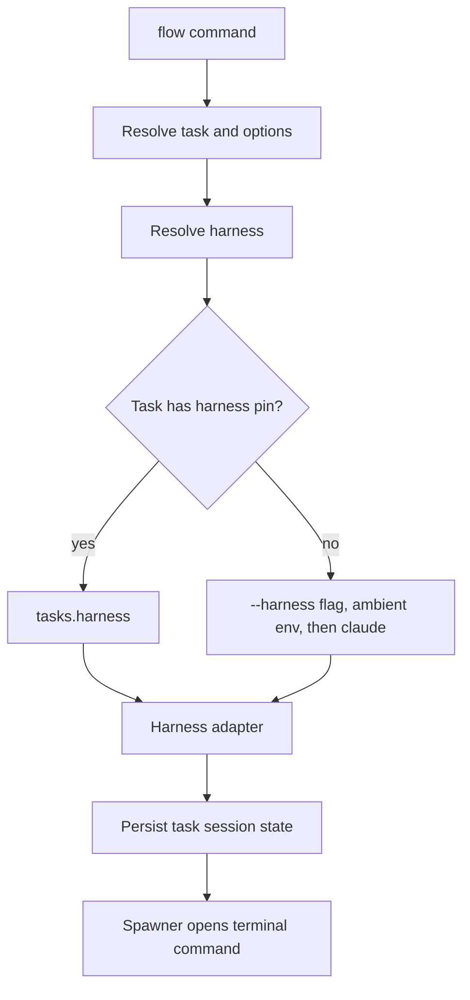
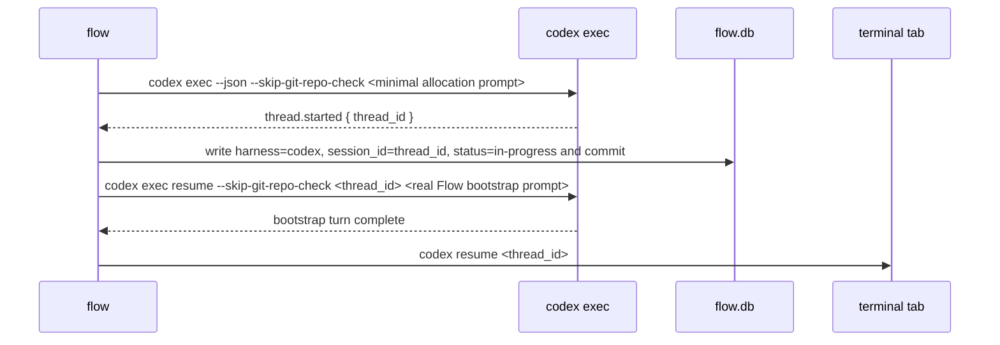

# Codex Harness Support Design

## Summary

`flow` should support OpenAI Codex sessions alongside Claude Code sessions without
changing the user's existing Flow database, knowledge base, or task workflows.
The implementation will extend the upstream harness abstraction already present
on `Facets-cloud/flow` `origin/main` at commit
`aeb502ae910941535d230b89f68c025c927fcc46`, then add a Codex harness adapter.

The design keeps Claude as the default for existing tasks and for users running
`flow` from an ordinary terminal. Codex is selected explicitly with
`flow do --harness codex`, or implicitly when `flow` is run from inside a Codex
session that exposes `CODEX_THREAD_ID`.

## Goals

- Add a first-class `codex` harness that can create, resume, bind, detect, and
  render Codex-backed task sessions.
- Preserve existing Claude behavior and database compatibility.
- Keep old rows with `tasks.harness` unset working as Claude rows.
- Support real Codex integration testing while protecting the user's real
  `~/.flow/flow.db` and `~/.flow/kb`.
- Install/update Flow's Codex skill and SessionStart hook when requested, and
  use manual QA backup-before-write safeguards for real user Codex files during
  this implementation effort.
- Produce an implementation branch in the user's fork for eventual upstream PR.

## Non-Goals

- Do not migrate existing Claude task sessions to Codex.
- Do not create a provider-neutral LLM protocol beyond the harness interface
  needed by Flow.
- Do not edit the user's real Flow database or knowledge base during
  development or tests.
- Do not make Codex the default harness for ordinary terminal invocations.
- Do not depend on `~/.codex/session_index.jsonl` for transcript lookup.

## Working Tree And Data Safety

All code and docs work happens in an isolated worktree:

- Repository worktree: `/private/tmp/flow-codex-support`
- Branch: `codex/codex-harness-support`
- Base: `origin/main` at `aeb502ae910941535d230b89f68c025c927fcc46`
- Push target: `fork/codex/codex-harness-support`
- PR target: `Facets-cloud/flow:main`

Manual tests must never run against the user's production Flow data. Use these
paths for all Flow-side test state:

```bash
FLOW_ROOT=/private/tmp/flow-codex-dev/flow-root
GOCACHE=/private/tmp/flow-codex-dev/go-cache
```

Real Codex-side integration is allowed only for Codex files and only after
backups:

- `~/.agents/skills/flow` may be installed or updated after copying any
  existing directory to a timestamped backup.
- `~/.codex/hooks.json` may be updated after copying it to a timestamped backup.
- `~/.codex/config.toml` may be inspected for hook enablement but not edited
  without an explicit user confirmation.

The current checkout at `/Users/Swapnil/workspace/swapnil/flow` is a read-only
reference during this work.

## Existing Baseline

The local checkout predates the upstream harness refactor, but `origin/main`
already includes the refactor. The isolated worktree starts from that upstream
baseline rather than the local dirty `main`.

Upstream `origin/main` currently has one baseline test failure in this
environment:

```text
go test ./internal/app -run TestCmdListTasksSinceToday -count=1 -v
list_test.go:192: expected today-task; out="(no tasks)\n"
```

This failure is unrelated to Codex support and must be tracked separately in the
implementation plan. Codex work should still run package and full-suite tests so
new failures can be distinguished from this baseline issue.

## Architecture

Flow delegates all agent-specific behavior to registered harness adapters.
Application commands should not know how Claude or Codex store transcripts,
which environment variable they expose, or which CLI flags they use.
Spawner behavior should continue to pass the current `FLOW_ROOT` into new
terminal tabs when it is set, so manual QA against a temp Flow root cannot fall
back to production `~/.flow`.



The harness registry remains small and explicit:

```go
func allHarnesses() []harness.Harness {
    return []harness.Harness{
        claude.New(),
        codex.New(),
    }
}
```

## Harness Interface

The upstream interface assumes every harness can return a session id before
launch via `NewSessionID()`. Claude can do this because `claude --session-id`
accepts a caller-supplied UUID. Codex cannot create an empty interactive thread
with a caller-supplied id, so the interface must change before adding Codex.

Replace the fresh-session pair:

```go
NewSessionID() (string, error)
LaunchCmd(sessionID, prompt string, opts LaunchOpts) string
```

with a prepared fresh-session operation:

```go
type PreparedSession struct {
    SessionID     string
    LaunchCommand string
}

type SessionContext struct {
    WorkDir string
    Env     []string
}

PrepareFreshSession(ctx SessionContext, prompt string, opts LaunchOpts) (PreparedSession, error)
BootstrapFreshSession(ctx SessionContext, sessionID, prompt string, opts LaunchOpts) error
```

`SessionContext.WorkDir` is the task work directory. Synchronous harness
subprocesses must run with `cmd.Dir = ctx.WorkDir`. `SessionContext.Env` is the
Flow process environment to pass through; when nil, implementations inherit
`os.Environ()`. This preserves test `FLOW_ROOT` and other Flow-side variables
while ensuring Codex records the correct workspace context.

Claude implementation:

- Generate a v4 UUID locally.
- Return launch command `claude --session-id <uuid> <prompt>`.
- Append `--dangerously-skip-permissions` when requested.
- Implement `BootstrapFreshSession` as a no-op because Claude receives the real
  bootstrap prompt in the launch command.

Codex implementation:

- `PrepareFreshSession` runs a minimal Codex allocation prompt with
  `codex exec --json`.
- Parse the first `thread.started` event's top-level `thread_id`.
- Continue reading the JSON stream until the allocation `codex exec` process
  exits.
- Return `PreparedSession` only if the process exits successfully. If the
  allocation process exits non-zero after emitting a thread id, Flow must report
  the allocation error and must not bind the task row to that id.
- Return launch command `codex resume <id>`.
- `BootstrapFreshSession` runs the real Flow bootstrap synchronously with
  `codex exec resume <id> <prompt>` after Flow has bound the task row and before
  Flow spawns the interactive terminal.
- Both Codex subprocesses run in `ctx.WorkDir` and inherit `ctx.Env`.

The minimal allocation prompt is:

```text
Initialize a new flow-managed Codex thread. Do not inspect files, run commands,
or modify anything. Reply exactly: flow session allocated.
```

The rest of the interface stays provider-specific behind the adapter:

- `Name()`, `Binary()`, `SessionIDEnvVar()`
- `ValidateSessionID`
- `ValidateSession`
- `ResumeCmd`
- `SkipPermissionsRun(ctx SessionContext, prompt string) error`
- `LiveSessionIDs`
- `RenderTranscript`
- skill and hook install/uninstall methods

## Codex Session Lifecycle

Current Codex behavior from the OpenAI Codex source and docs:

- Codex exposes `CODEX_THREAD_ID` in shell/tool environments.
- Codex thread/session ids are UUIDs generated as UUIDv7.
- `codex exec --json` emits `thread.started` with `thread_id`.
- `codex exec resume <id> <prompt>` accepts a prompt.
- Interactive `codex resume <id>` does not accept a prompt.
- Codex rollouts live under `$CODEX_HOME/sessions/YYYY/MM/DD/`.
- Codex `exec` calls launched by Flow should include
  `--skip-git-repo-check` so tasks in non-git work directories behave like
  existing Claude-backed tasks.

Fresh Codex sessions must use a mint-bind-bootstrap-resume sequence:



This avoids the earlier flawed sequence where the real Flow bootstrap prompt
ran before the task row was bound. The real bootstrap can safely call
`flow show task` with no explicit ref because the resumed Codex turn receives
`CODEX_THREAD_ID` and Flow can reverse-lookup the task.

If the bootstrap resume step fails after the DB row is written, Flow should
roll back the fresh bind when it can do so safely with the same compare-and-swap
pattern used by the existing fresh-spawn failure path. If rollback fails because
the row changed concurrently, Flow should report the failure and leave the row
untouched rather than guessing.

The real bootstrap step is not part of the terminal launch command. Flow runs it
synchronously so Flow can observe failure and apply the rollback rule above.
The task bind must be committed before Flow starts the bootstrap subprocess,
because that subprocess runs `flow show task` as a separate process and must be
able to observe the session row. The fresh Codex order is therefore: mint thread,
bind in a transaction, commit, run bootstrap, and use a post-commit
compare-and-swap rollback if bootstrap fails.

Fresh `--with` behavior:

- For Claude, the injection text remains appended to the first launch prompt.
- For Codex fresh sessions, `BootstrapFreshSession` sends one resumed exec turn
  containing the Flow bootstrap prompt plus `harness.InjectionMarker` and the
  injection text.
- For Codex resume of an existing task, injection remains a separate
  `codex exec resume <id> <injection>` before interactive `codex resume <id>`.

Resume behavior:

- No injection: `codex resume <id>`
- With `--with`: `codex exec resume --skip-git-repo-check <id>
  <injection prompt>` followed by `codex resume <id>`

Permission bypass:

- Flow's existing `--dangerously-skip-permissions` maps to Codex
  `--dangerously-bypass-approvals-and-sandbox`.
- The Codex flag is used only where Flow already supports an explicit dangerous
  path.

## Command Surface

Add `--harness claude|codex` to `flow do`.

Selection rules for unpinned tasks:

1. Explicit `--harness`
2. Ambient session environment (`CODEX_THREAD_ID` or `CLAUDE_CODE_SESSION_ID`)
3. Claude default

If multiple known harness env vars are set for an unpinned `flow do`, Flow
should error and require `--harness` rather than guessing.

Pinned tasks use `tasks.harness`. A different explicit harness should error
unless the user takes an existing explicit replacement path such as `--fresh`
or `--force`, matching current Flow safety semantics.

`flow do --here` detects the current harness from environment variables:

- Claude: `CLAUDE_CODE_SESSION_ID`
- Codex: `CODEX_THREAD_ID`

If multiple known harness env vars are set, `--here` should require
`--harness` to disambiguate.

`flow show task`, `flow show project`, and `flow transcript` with no task ref
must use the ambient harness's session id and look up the matching task.
If multiple known harness env vars are set, they should error and require an
explicit task ref because these commands do not accept a harness selector today.

Add `--harness claude|codex` to `flow run playbook` and forward it to the
generated run task's `flow do` path. This keeps playbook runs usable from a
plain terminal for Codex users. If omitted, playbook run harness selection uses
the same precedence as `flow do`: ambient harness, then Claude default.

## Database Design

Add a nullable `tasks.harness TEXT` column if the upstream baseline does not
already include it. A NULL or empty harness is treated as `claude`.

The task session invariant remains:

- `status = 'backlog' OR session_id IS NOT NULL`

Session id uniqueness remains enforced. If the implementation keeps the
upstream single-column unique index on `session_id`, that is acceptable because
UUID collision across harnesses is not a practical concern. If the
implementation changes uniqueness to include harness, it must use
`COALESCE(harness, 'claude')` so old NULL rows stay unique.

No data migration should rewrite old task rows just to set `harness='claude'`.
Lazy interpretation keeps the migration small and reversible.

## Skill Installation And Auto-Upgrade

Claude skill path remains:

```text
~/.claude/skills/flow/SKILL.md
```

Codex skill path is:

```text
~/.agents/skills/flow/SKILL.md
```

Add harness selection to skill commands:

```bash
flow skill install --harness auto|claude|codex|all
flow skill update --harness auto|claude|codex|all
flow skill uninstall --harness auto|claude|codex|all
```

Default `auto` uses the ambient harness if Flow is running inside one,
otherwise Claude.

`maybeAutoUpgradeSkill()` must become per-harness:

- Iterate over registered harnesses.
- Only update a harness whose skill file already exists.
- Write that harness's `VERSION` sidecar.
- Refresh that harness's SessionStart hook.
- Remove stale Claude `UserPromptSubmit` hooks where applicable.
- Do not auto-install Codex just because the binary supports Codex.

The embedded Flow skill must become harness-neutral. It should describe:

- `flow do --harness codex`
- `CODEX_THREAD_ID`
- `CLAUDE_CODE_SESSION_ID`
- Codex skill location
- Codex hook trust review
- Harness-neutral wording for sessions and transcripts

## Hooks

Claude hook behavior remains compatible with `~/.claude/settings.json`.
The existing Claude hook command string must remain exactly
`flow hook session-start` so installed Claude hooks are not orphaned.

Codex hook install targets:

```text
~/.codex/hooks.json
```

The Codex hook command should identify the intended harness:

```bash
flow hook session-start --harness codex
```

Use a separate Codex hook command constant rather than changing the Claude
constant.

The hook handler should:

- Parse hook stdin when available.
- Prefer the hook-provided `session_id` for Codex.
- Fall back to `CODEX_THREAD_ID` or `CLAUDE_CODE_SESSION_ID` when stdin lacks
  a session id.
- Emit the existing `hookSpecificOutput.additionalContext` response shape.

Hook enablement:

- Detect current Codex hook feature naming where practical.
- Treat legacy `codex_hooks` as an older config name.
- Warn if hooks appear disabled.
- Do not edit `~/.codex/config.toml` without explicit user approval.

## Transcript Rendering

Codex transcripts are rollout JSONL files under:

```text
$CODEX_HOME/sessions/YYYY/MM/DD/rollout-...-<thread_id>.jsonl
```

Default `CODEX_HOME` is:

```text
~/.codex
```

Lookup strategy:

1. Search `$CODEX_HOME/sessions` for rollout files whose filename contains the
   target thread id.
2. Verify the first `session_meta` line payload id matches the target id.
3. If multiple files match, choose the newest verified file by modification
   time.
4. Do not use `session_index.jsonl` as the primary lookup because it is not a
   reliable id-to-path index.

Renderer behavior:

- Render user and assistant messages into the existing normalized transcript
  style.
- Render tool calls and command executions as tool sections.
- Render tool output only when not compact.
- Omit reasoning and verbose internal metadata in compact mode.
- Skip malformed lines rather than failing the entire transcript, but fail if no
  verified rollout exists.

## Close-Out Sweep

`flow done` should run the close-out sweep through the task's harness:

- Claude uses the existing `claude -p` dangerous path.
- Codex uses `codex exec` with
  `--skip-git-repo-check` and
  `--dangerously-bypass-approvals-and-sandbox`.
- Harness close-out subprocesses should run from the task work directory and
  inherit the Flow process environment, including any test `FLOW_ROOT`.

The close-out prompt should remain harness-neutral and continue to call
`flow transcript <slug>` so transcript decoding stays centralized in Flow.

Sweep failure remains non-fatal after the task is marked done.

## Live Session Detection

Claude keeps its existing process scan for `--session-id` and `--resume`.

Codex live detection should scan process command lines for:

- `codex resume <uuid>`
- `codex exec resume <uuid>` while an injected turn is running

Bare Codex sessions without a visible thread id are not detectable. This is
acceptable because Flow-created Codex sessions use `codex resume <id>`.

## Implementation And PR Workflow

The implementation branch should be pushed to the user's fork:

```bash
git push -u fork codex/codex-harness-support
```

The eventual pull request should target:

```text
Facets-cloud/flow:main
```

Implementation should be split into small commits:

1. Import or reconcile upstream harness baseline if needed.
2. Adjust harness fresh-session interface.
3. Add Codex harness adapter with fake-runner tests.
4. Wire command surfaces and DB behavior.
5. Add Codex skill and hook support.
6. Add transcript rendering.
7. Add integration docs and manual QA notes.

## Test Strategy

Automated tests must not call the real Codex binary. Use fake runners and temp
directories.

Required test coverage:

- Harness resolver precedence: explicit flag, ambient env, task pin, default.
- `flow do --harness codex` fresh session success and failure rollback.
- Codex `thread.started` parsing.
- Codex resume command construction with and without `--with`.
- Dangerous flag mapping.
- `flow do --here` with `CODEX_THREAD_ID`.
- Ambiguous nested env var error.
- `flow run playbook --harness codex` forwards harness selection to the
  generated run task.
- Per-harness skill install/update/uninstall.
- Per-harness auto-upgrade.
- Codex hook install, uninstall, and stdin session id handling.
- Codex rollout path lookup and transcript rendering.
- `flow done` close-out sweep dispatch through the task harness.
- Existing Claude tests still pass except for any documented unrelated baseline
  failure.

Manual real-Codex QA uses production Codex but temp Flow state:

```bash
FLOW_ROOT=/private/tmp/flow-codex-dev/flow-root \
GOCACHE=/private/tmp/flow-codex-dev/go-cache \
PATH=/private/tmp/flow-codex-support/bin:$PATH \
/private/tmp/flow-codex-support/bin/flow do --harness codex <temp-task>
```

Before manual QA:

- Build the dev binary in the worktree.
- Copy or build it to `/private/tmp/flow-codex-support/bin/flow`.
- Prepend `/private/tmp/flow-codex-support/bin` to `PATH` for all manual QA
  commands so Codex-internal `flow` calls, hooks, and bootstrap prompts resolve
  to the dev build rather than the production installed binary.
- Backup any existing `~/.agents/skills/flow`.
- Backup `~/.codex/hooks.json`.
- Install/update the Codex skill and hook intentionally.
- Use Codex `/hooks` to review or trust the installed hook if Codex requires
  hook approval.
- Confirm `flow show task`, `flow transcript`, and `flow done` operate on the
  temp `FLOW_ROOT`.
- From inside the Codex session, run `flow version` or `which flow` and confirm
  it resolves to the dev binary path before testing task behavior.

Backup-before-write is a manual QA safety rule for this implementation effort,
not a new product behavior. Product `flow skill install`, `update`, and
auto-upgrade should remain idempotent and match existing Claude semantics unless
the user explicitly asks for backup functionality later.

## Risks And Mitigations

- Codex CLI behavior changes: keep Codex command construction behind the
  adapter and pin tests to fixture output.
- Bootstrap failure after thread allocation: bind only after `thread.started`,
  then roll back safely if the real bootstrap resume fails.
- Hook feature naming changes: detect both current and legacy names and warn
  rather than editing config automatically.
- Transcript schema changes: decode tolerant JSON objects and test with minimal
  rollout fixtures.
- User data mutation: require temp `FLOW_ROOT` for all Flow-side manual QA and
  backup-before-write for real Codex files.

## Spec Self-Review

- Placeholder scan: no placeholder markers remain.
- Consistency check: fresh Codex lifecycle uses mint, bind, bootstrap, resume
  everywhere.
- Scope check: this spec is focused on Flow harness-level Codex support and does
  not include unrelated Flow feature work.
- Ambiguity check: safety boundaries, harness selection, transcript lookup, and
  hook behavior are explicit.
